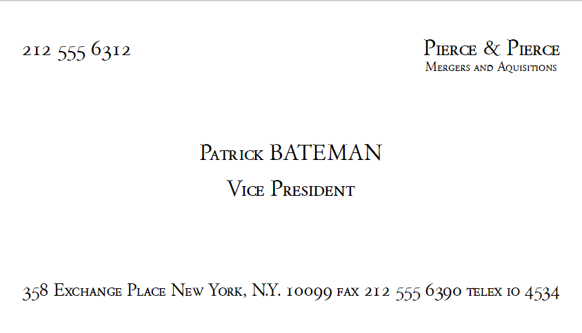

# The Patrick Bateman Business Card Template: A killer (haha) business card template

    

## About
Calling all American Psycho fans! Here is a LaTex template of Patrick Bateman's business card. Maybe you can become the next great investment banking vice president.

### Requirements
- Download the Garamond Classico SC Regular font from the internet and upload the Garamond Classico SC Regular.ttf file into the same directory where main.tex is.
- Set `texStudio` to compile with `XeLaTeX`.
- Then use Overleaf or another Tex compiler to compile the source code.

### Usage
- In the `main.tex` use the space between the `\begin{document}` and `\end{document}` to piece together components, as well as alter spacing between the components using `\vspace{}`.
- To change the components, check out the `Components` folder and alter the `.tex` files there. 
- To alter the dimensions of the file, check the first 20 files of the `main.tex` file where the dimensions are set and other packages are installed.

## Contributing
Contributors are welcome! Please fork the repository and create a pull request.

## License
Distributed under the MIT License. See `LICENSE.md` for more information.

## Contact
[Link to Author](https://github.com/divamkumar)